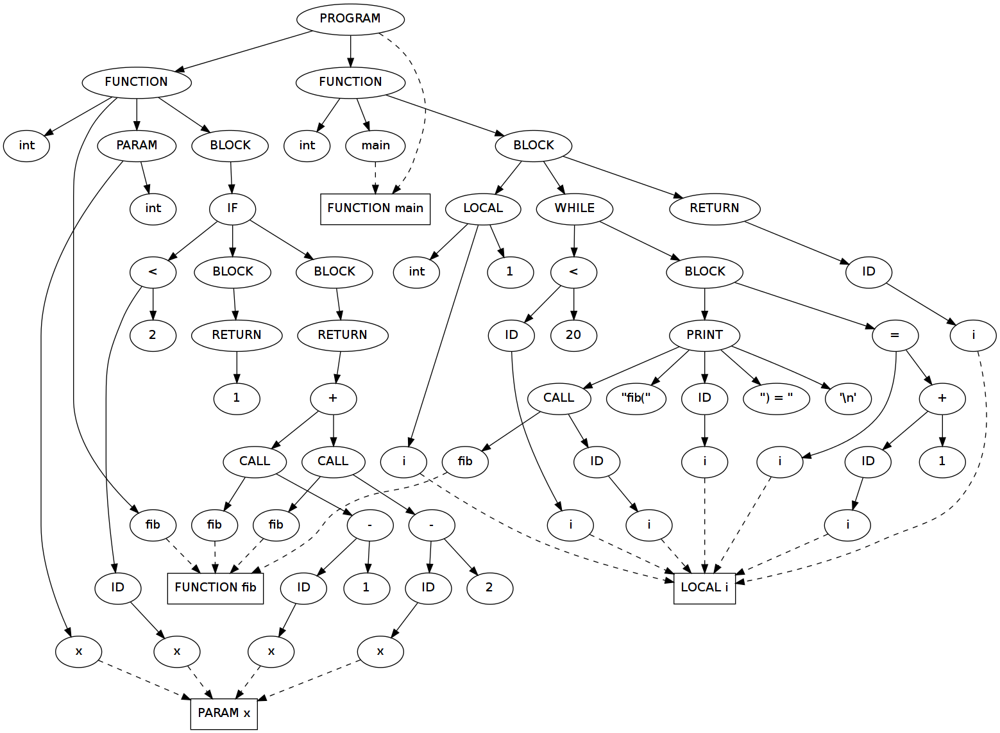

C Minor Compiler
----------------

This is a Java-implemented compiler for a miniature programming language called
"C Minor." The Makefile generates a Java program which reads C Minor code as
input and prints compiled AT&T-syntax x86 assembly code as output, or else
reports errors on ill-formed input.

This project was completed on May 10, 2013 for a university compilers course.

Dependencies
------------

The Java Cup (`java_cup/`) and JFlex (`jflex/`) tools are used to generate the
compiler's lexer and parser classes and are both included with this project in
conformance with their respective licenses.

* http://www2.cs.tum.edu/projects/cup/
* http://jflex.de/

This project was developed in a Linux environment, and although the source code
is written in portable Java, the peripheral scripts and Makefile may depend on
commands or files not present on every system. These include `dot`, `tempfile`,
xdg-open.

Of course, you must have `javac`, `java`, and `make` installed to compile and execute
the program (`ant` is not used).

Building
--------

The Makefile provided contains rules for generating the C minor compiler from
JFlex, Java Cup, and Java source files as well as rules for compiling test
inputs using the generated compiler. All of the compiler code resides in the
`cminor` Java package, and the main class which serves as the C Minor compiler is
`cminor.Compiler`.

In order to build `cminor.Compiler` from its sources, simply use

    make

Running
-------

Once the compiler has been built, it is invoked using

    java cminor.Compiler [options]

The C Minor compiler has a number of different options and modes. These options
can be used to control whether the compiler reads from `stdin` or from a file,
writes code to `stdout` or a file, and generates x86 code or dot code for
visualizing the abstract syntax tree. Without any arguments the compiler reads
C Minor from stdin and sends compiled x86 code to stdout if the input is valid.
In order to see all of the available options, use

    java cminor.Compiler -h

Testing
-------

The project comes with a number of tests which were used to validate the
behavior and features of the compiler. These files are all under the `test/`
directory. The directory `test/ast/` contains a set of over 40 tests which
demonstrate various features of the compiler. For any test file in this directory,
use

    make test/ast/<filename>

to attempt to use the C Minor compiler to produce x86 code from the
corresponding `.cm` file, assemble it, and link it into an executable.

There is another test in the `test/ms/` directory which pulls together several
aspects of the project. It is the Fibonacci program provided for the syntax
analysis phase of the project. To compile it, use

    make test/ms/test

and then use

    ./test/ms/test

to verify that it prints out the first 20 or so Fibonacci numbers.

The `scripts/` directory contains a number of scripts which abbreviate certain
modes of the C Minor compiler to a single command. For example, the script
`scripts/resolve` reads a C Minor file, prints its contents, and uses the C Minor
compiler to generate dot code for displaying the abstract syntax tree of the
input program including nodes for resolved symbols. It then uses the dot
command to produce an image of the tree and opens it in the user's preferred
application using `xdg-open`.

Implementation
--------------

The compiler is written in Java and makes extensive use of the visitor pattern.
This design decision is a result of the benefits of having closely-related code
for each compiler phase kept in the same class file instead of spread out
accross several abstract syntax tree node class files.

The project is separated into the following phases:

1. Lexing (sends tokens to the parser using `jflex`)
2. Parsing (builds an abstract syntax tree using `java_cup`)
3. Symbol resolution (resolves identifiers and other symbols in the AST)
4. Type checking (resolves and validates expression types and performs other semantic analyses)
5. Code generation (assuming the AST has been fully validated and resolved, proceeds to generate x86 code)

For the sake of simplicity, the generated code simulates a stack machine. It
should be considered pre-optimization assembly code. All return and expression
values are passed through `%eax`; all function arguments are passed through the
stack.

State of Completion
-------------------

All required functionality currently appears to be working. There is, of
course, no guarantee that the compiler or the programs which it generates will
not bug out unexpectedly, but the experience of using them so far suggest that
the compiler is generally quite sound. It works on all test programs provided.

The compiler implements (or at least supposes to implement) the following
features:

* Error checking during the scanning phase
* Error recovery during the parsing phase
* Location information for errors in the input and descriptive error
  messages for semantic errors
* Validation that a main function exists with the correct signature
* Validation that functions with non-void return types return values in
  all branches of execution
* Detection of unreachable statements
* Use of a string table to minimize the number of string literals
  included in the resulting program
* Packing of constant values into the format strings used by the calls
  to printf which underlie print statements
* Ensurance that the literal arguments to print cannot be used to
  insert extra format specifiers that break the underlying printf
  implementation
* Printing of "true" and "false" for boolean values
* Implementation of lexical scoping rules
* Control flow statements if, else, and while
* Short-circuited logical operators
* Awesomeness

